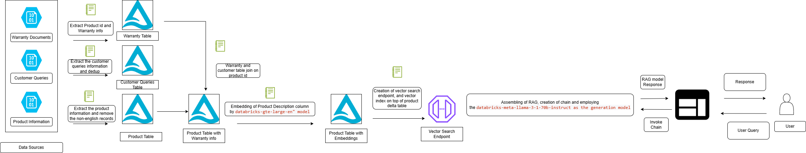

# 🛍️ Smart AI Assistant System

This project implements an end-to-end Retrieval-Augmented Generation (RAG) pipeline on **Databricks**, enabling natural language interaction with product data using embeddings, vector search, LangChain, and a Gradio interface.

---

## 📦 Features

- Embeds product descriptions using a deployed MLflow embedding model.
- Stores product vectors in a Databricks Vector Search index.
- Uses LangChain’s RAG pipeline with a chat LLM (e.g., ChatDatabricks).
- Deploys the assistant as a Gradio web app.
- Registers the entire chain to Unity Catalog and MLflow Model Registry.

---

## 🧭 Architecture Overview

## 🏗️ Workflow Overview

### 1. Product Data Preparation

- Load and clean raw product data from Unity Catalog.
- Join additional metadata such as warranty information.
- Store the final enriched product data in a Delta table (`product_final`).

### 2. Embedding Generation

- A pandas UDF is used to batch embed product descriptions using a deployed MLflow embedding model.
- Output is a 1024-dimensional vector for each product.
- Result is written to a new Delta table for downstream use.

### 3. Vector Index Creation

- A Databricks Vector Search endpoint is created (`STANDARD` type).
- A Delta sync index is created using:
  - Primary key (`Uniq_Id`)
  - Vector column (`product_description_embedding`)
- The index supports TRIGGERED sync to enable manual refreshes.

### 4. Change Data Feed Activation

- Change data feed is enabled on the table to support incremental indexing and low-latency updates.

### 5. Embedding User Queries

- User input is embedded at runtime using the same embedding model deployed via MLflow.
- Embeddings are retrieved using `deploy_client.predict(...)`.

### 6. Vector Similarity Search

- The user query embedding is used to perform similarity search against the vector index.
- Top N matches (e.g., 5) are returned, including titles and descriptions.

### 7. LangChain Integration

- A custom retriever function wraps vector search results into LangChain `Document` objects.
- A system prompt defines assistant behavior (e.g., helpful, concise, product-focused).
- LangChain’s `create_retrieval_chain` is used to combine retriever and LLM.

### 8. Model Logging with MLflow

- The complete RAG chain is logged using `mlflow.langchain.log_model`.
- The model is registered in Unity Catalog via `registered_model_name`.
- Input/output signatures and dependencies are tracked.

### 9. Gradio Interface

- A simple chat UI is built using Gradio.
- Users can type natural language questions.
- LangChain chain is invoked in the backend to return product-specific answers.
- Interface is launched with `share=True` to enable external access.

---

## 📋 Example Questions

| Example Question                                             | System Behavior                              |
|-------------------------------------------------------------|-----------------------------------------------|
| "Do you have cruelty-free moisturizers?"                    | Returns relevant products with those tags     |
| "What products help with anti-aging?"                       | Matches related items from descriptions       |
| "Show me sunscreens with SPF above 50"                      | Filters based on numeric/SPF keywords         |
| "Do you sell hair oils for dry scalp?"                      | Searches for products solving dry scalp       |

---

## ⚙️ Required Tools and Libraries

- **Databricks Runtime:** 13.3 LTS or 14.x (Python 3.10+ recommended)
- **Installed Libraries:**
  - `databricks-sdk`
  - `databricks-vectorsearch`
  - `databricks-cli`
  - `mlflow`
  - `langchain`
  - `gradio`

---

